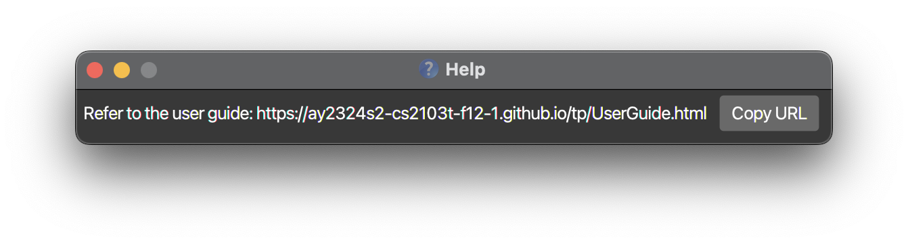

# NetConnect User Guide

NetConnect is a desktop app for managing contacts in SMEs, optimized for use via a Command Line Interface (CLI) while still having the benefits of a Graphical User Interface (GUI). It enables HR and relations managers to efficiently manage their employees, clients, as well as suppliers, **all in one place** ☝🏻.

The inspiration behind NetConnect lies in solving a specific set of challenges faced by the food business managers demographic. Specifically, we aim to address the challenge of managing various contact types: clients, suppliers, and employees.

If you relate to this problem we identified, then NetConnect might be just right for you. This user guide will accompany you in maximising the capabilities of this product, freeing time for more pressing issues.

# Table of Contents

* [Quick start](#quick-start)
* [Features](#features)
    + [Viewing help : `help`](#help)
    + [Adding a person: `add` ](#add)
    + [Deleting a person : `delete`](#delete)
    + [Listing all persons : `list`](#list)
    + [Editing a person : `edit`](#edit)
    + [Locating persons by name: `find`](#find)
    + [Clearing all entries : `clear`](#clear)
    + [Create Relations between Profiles : `relate`](#relate)
    + [Show Relations Associated to a Person : `showrelated`](#showrelated)
    + [Open on Last State](#open-on-last-state)
    + [Export Current View to CSV File : `export`](#export)
    + [Never Miss a Birthday!](#birthday)
    + [Exiting the program : `exit`](#exit-program)
    + [Saving the data](#saving-the-data)
    + [Editing the data file](#editing-the-data-file)
* [Future Implementations](#future-implementations)
* [FAQ](#faq)
* [Known issues](#known-issues)
* [Command summary](#command-summary)

# Quick start

1. Ensure you have Java `11` or above installed in your Computer.

1. Download the latest `netconnect.jar` from [here](https://github.com/AY2324S2-CS2103T-F12-1/tp/releases).

1. Copy the file to the folder you want to use as the _home folder_ for your NetConnect.

1. Open a command terminal, `cd` into the folder you put the jar file in, and use the `java -jar netconnect.jar` command
   to run the application. 
   A GUI similar to the below should appear in a few seconds. Note how the app contains some sample data. 
   

1. Type the command in the command box and press Enter to execute it. e.g. typing **`help`** and pressing Enter will
   open the help window. 
   Some example commands you can try:

    * `list` : Lists all contacts.

    * `add n/John Doe p/98765432 e/johnd@example.com a/John street, block 123, #01-01 r/employee` : Adds an employee
      named `John Doe` to the Address Book.

    * `delete i/3` : Deletes the contact with ID 3 from NetConnect.

    * `clear` : Deletes all contacts. (We caution against doing this until you have fully experimented with the sample
      contacts provided.

    * `exit` : Exits the app.

1. Refer to the [Features](#features) below for details of each command.

--------------------------------------------------------------------------------------------------------------------

# Features

<box type="info" seamless>

**Notes about the command format:** 

* Words in `UPPER_CASE` are the parameters to be supplied by the user. 
  e.g. in `add n/NAME`, `NAME` is a parameter which can be used as `add n/John Doe`.

* Items in square brackets are optional. 
  e.g `n/NAME [t/TAG]` can be used as `n/John Doe t/friend` or as `n/John Doe`.

* Items with `…`​ after them can be used multiple times including zero times. 
  e.g. `[t/TAG]…​` can be used as ` ` (i.e. 0 times), `t/friend`, `t/friend t/family` etc.

* Parameters can be in any order. 
  e.g. if the command specifies `n/NAME p/PHONE_NUMBER`, `p/PHONE_NUMBER n/NAME` is also acceptable.

* Extraneous parameters for commands that do not take in parameters (such as `help`, `list`, `exit` and `clear`) will be ignored. 
  e.g. if the command specifies `help 123`, it will be interpreted as `help`.

* If you are using a PDF version of this document, be careful when copying and pasting commands that span multiple lines as space characters surrounding line-breaks may be omitted when copied over to the application.
  </box>

<section id="help">

## Viewing help : `help`

Shows a message explaining how to access the help page.

Format: `help`

</section>

<section id="add">

## Adding a person: `add`

Adds a person (Client, Supplier or Employee) to the address book. Note that each role (eg. Client, Supplier, Employee) has its own specific set of fields that can be added.

Format: `add n/NAME p/PHONE_NUMBER e/EMAIL a/ADDRESS role/ROLE [dob/yyyy-mm-dd][t/TAG]…​`

Examples:
* `add n/John Doe p/98765432 e/johnd@example.com a/John street, block 123, #01-01 role/client t/friend`
* `add n/Betsy Crowe t/friend e/betsycrowe@example.com a/Newgate Prison p/1234567 role/supplier`
* `add n/Bob Ye p/8928732 e/boby@example.com a/Blk 11, Clementi Ave 1, #03-32 t/friends t/coreTeam r/requires follow up on pay raise role/employee dept/HR job/Manager pref/Likes to work from home tos/2 years prod/Laptop skills/Java`

Examples (Employee):
* Format: `add n/NAME p/PHONE_NUMBER e/EMAIL a/ADDRESS role/ROLE [t/TAG] [dept/DEPARTMENT] [job/JOB] [skills/SKILL 1, SKILL 2] [pref/PREFERENCES] [tos/TERMS OF SERVICE]`
* `add n/Bob Ye p/8928732 e/boby@example.com a/Blk 11, Clementi Ave 1, #03-32 t/friends t/coreTeam r/requires follow up on pay raise role/employee dept/HR job/Manager pref/Likes to work from home tos/2 years skills/Java`

Examples (Client):
* Format: `add n/NAME p/PHONE_NUMBER e/EMAIL a/ADDRESS role/ROLE [t/TAG] [pref/PREFERENCES] [prod/PRODUCT 1] [prod/PRODUCT 2]`
* `add n/Benson Mayer p/87728933 e/mayerb@example.com a/311, Clementi Ave 2, #02-25 role/Client pref/Dairy-free prod/Sourdough bread prod/Raisin Bread`

Examples (Supplier):
* Format: `add n/NAME p/PHONE_NUMBER e/EMAIL a/ADDRESS role/ROLE [t/TAG] [tos/TERMS OF SERVICE] [prod/PRODUCT 1] [prod/PRODUCT 2]`
* `add n/Fiona Kunz p/9482427 e/lydia@example.com a/little tokyo role/Supplier tos/Delivery within 2 weeks prod/Office Supplies prod/Furniture`

**Info:** NetConnect checks for unique profiles by its NAME, PHONE and EMAIL. It does not allow you to create two profiles with identical name, phone number and email.

**Constraints:**
Constraints for each field. Here are the constraints for each field in the application:

* `NAME`: Names should only contain alphanumeric characters and spaces, and it should not be blank.
* `PHONE_NUMBER`: Phone numbers should only contain numbers, and it should be at least 3 digits long to accommodate staff extensions.
* `EMAIL`: Emails should be of the format `local-part@domain`. NetConnect does not check for the validity of the domain part, hence extra attention should be put into ensuring no typos are present in the domain part of the email.
* `ADDRESS`: Addresses can take any format, and it should not be blank.
* `ROLE`: Roles can only be `client`, `supplier`, or `employee`.
* `TAG`: Tags should only contain alphanumeric characters and spaces, and it should not be blank.
* `DEPARTMENT`: Department names should only contain alphanumeric characters and spaces, and it should not be blank.
* `JOB`: Job titles should only contain alphanumeric characters and spaces, and it should not be blank.
* `SKILLS`: Skills should only contain alphanumeric characters and spaces, and it should not be blank.
* `PREFERENCES`: Preferences can take any format, and it should not be blank.
* `TERMS OF SERVICE`: Terms of service can take any format, and it should not be blank.
* `PRODUCTS`: Product names should only contain alphanumeric characters and spaces, and it should not be blank.

</section>

<section id="delete">

## Deleting a person : `delete`

Deletes the specified person from the address book.

Format: `delete [n/NAME] [i/ID]`

* Deletes the person with the specified `NAME` or `ID`.
* If there are more than one person with the specified `NAME`, `ID` has to be used.
* `ID` refers to the unique identification number assigned to each person when first added to the list.
* `ID` **must refer to a person that exist within NetConnect**.
* Full name must be provided for `NAME`.

Examples:
* `delete i/2` deletes the person with an ID of 2 in the address book.
* `delete n/John Doe` deletes the person with the name John Doe (if no one else have the same name).

**Warnings:** Due to the destructive nature of this action, NetConnect will require a confirmation from the user before it is executed.
</section>

<section id="list">

## Listing all persons : `list`

Shows a list of all persons in the address book.

Format: `list`
</section>

<section id="edit">

## Editing a person : `edit`

Edits an existing person in the address book.

Format: `edit i/ID [n/NAME] [p/PHONE_NUMBER] [e/EMAIL] [a/ADDRESS] [role/ROLE] [t/TAG]…​`

* Edits the person with the specified `ID`. `ID` refers to the unique identification number assigned to each person when first added to the list.
* `ID` **must refer to a person that exist within NetConnect**.
* At least one of the optional fields must be provided.
* Existing values will be updated to the input values.
* When editing tags, the existing tags of the person will be removed i.e. adding of tags is not cumulative.
* You can remove all the person’s tags by typing `t/` without specifying any tags after it.
* You cannot edit a field that is invalid to the current person type.

Examples:
* `edit i/1 p/91234567 e/johndoe@example.com` Edits the phone number and email address of the person with ID of 1 to be `91234567` and `johndoe@example.com` respectively.
* `edit i/2 n/Betsy Crower t/` Edits the name of the person with ID of 2 to be `Betsy Crower` and clears all existing tags.

**Constraints:**
Constraints for each field. Here are the constraints for each field in the application:

* `NAME`: Names should only contain alphanumeric characters and spaces, and it should not be blank.
* `PHONE_NUMBER`: Phone numbers should only contain numbers, and it should be at least 3 digits long to accommodate staff extensions.
* `EMAIL`: Emails should be of the format `local-part@domain`. NetConnect does not check for the validity of the domain part, hence extra attention should be put into ensuring no typos are present in the domain part of the email.
* `ADDRESS`: Addresses can take any format, and it should not be blank.
* `ROLE`: Roles can only be `client`, `supplier`, or `employee`.
* `TAG`: Tags should only contain alphanumeric characters and spaces, and it should not be blank.
* `DEPARTMENT`: Department names should only contain alphanumeric characters and spaces, and it should not be blank.
* `JOB`: Job titles should only contain alphanumeric characters and spaces, and it should not be blank.
* `SKILLS`: Skills should only contain alphanumeric characters and spaces, and it should not be blank.
* `PREFERENCES`: Preferences can take any format, and it should not be blank.
* `TERMS OF SERVICE`: Terms of service can take any format, and it should not be blank.
* `PRODUCTS`: Product names should only contain alphanumeric characters and spaces, and it should not be blank.

</section>

<section id="find">

## Locating persons by name: `find`

Finds persons whose information matches any of the specified parameters. You can find persons by names, phone numbers, tags, roles, and remarks. To search via different fields, you can stack multiple `find`-type commands to narrow down your search.

Format: `find [n/NAME]... [t/TAG]... [p/PHONE_NUMBER]... [role/ROLE]... [r/REMARK]...`

* Only one type of field is allowed for each `find` command.
* Multiple parameters of the same field can be provided, showing persons who match any of the field in that command, e.g. `find n/alex n/david` will show all persons with either `alex` or `david` in their names.
* `list` is required to remove the stacked filters.
* Searches are case-insensitive, e.g. `hans` will match `Hans`.
* Partial matches are allowed for names, e.g. `Ha` will match `Hans`.
* Find by remark requires full word match that is contained in the remark sentence, e.g. `find r/marketing` will match `r/marketing IC`, `find r/has dog` will match `r/he has a dog`, `find r/market` will **not** match `r/marketing`.
* Find by remark requires all words given to be contained in the remark sentence, e.g. `find r/has cute dog` will **not** match ` r/he has a dog`.
* Find by remark allows unordered search, e.g. `find r/dog has` will match `r/he has a dog`.
* `find r/` will search for contacts with an empty remark.
* For phone numbers, tags and role, only exact matches are allowed, e.g. `83647382` or `8364` will not match `83641001`, `find t/fri` will not match contacts with tag `friends`, `find role/clie` will not match contacts with role `client`.

Find by name example:
* `find n/John` returns `john` and `John Doe`.
* `find n/alex n/david` returns `Alex Yeoh`, `David Li`. 

Find by tag example:
* `find t/friends` returns all persons who have the tag `friends`.

Find by phone number example:
* `find p/98765432` returns `John Doe` who has the phone number `98765432`.

Find by role example:
* `find role/client` returns all persons who have the role `client`.
* `find role/supplier role/client` returns all persons who have the role `supplier` or `client`.

Find by remark example:
* `find r/` returns all persons who have an empty remark.
* `find r/has a dog` returns all persons who have the remark `has a dog`.
* `find r/dog` returns all persons who have the remark `has a dog`.
* `find r/a has` returns all persons who have the remark `has a dog`.

Stacking find by name and tag example
* `find n/John` returns all persons who have the name `John`.

[insert screenshot]

* Followed by `find t/friends`, returns all persons who have the name `John` and the tag `friends`.

[insert screenshot]

</section>

<section id="clear">

## Clearing all entries : `clear`

Clears all entries from the address book.

Format: `clear`

**Warnings:** Due to the destructive nature of this action, NetConnect will require a confirmation from the user before it is executed.

</section>

<section id="relate">

## Create Relations between Profiles : `relate`

Creates a relation between two profiles in the address book.

Format: `relate i/ID i/ID`

Example: `relate i/1 i/2` creates a relation between the profiles with ID of 1 and 2.

</section>

<section id="showrelated">

## Show Relations Associated to a Person : `showrelated`

Shows all the relations associated to a person in the address book.

Format: `showrelated i/ID`

Example: `showrelated i/1` shows all relations between the profile with ID 1 and all other contacts.

**Info:** If there are no persons related to the provided ID, the interface will show `0 persons listed`.

</section>

<section id="open-on-last-state">

## Open on Last State
With every change to the command input, NetConnect saves and updates the command input in a separate file. When the app closes and is opened again, the last command present before closure will be retrieved from the separate file and input into the command field (if any). This way, you never have to worry about losing progress!

</section>

<section id="export">

## Export Current View to CSV File : `export`
Retrieve information on a group of profiles at once with this function! This can be useful for consolidating all the emails or contact number at once, or to share information with third parties.

**To export _all_ profiles in the address book to a CSV file:**

Step 1: `list`

Step 2: `export`

* The `list` command in the first step is to pull all profiles into the current view.

**To export a _specific_ group of profiles to a CSV file:**

Step 1: `find [KEYWORD]` or any other function that filters the profiles.

Step 2: `export`

* The first step is to filter the profiles you want to export into the current view.

</section>

<section id="birthday">

## Never Miss a Birthday!
Celebrate your employees' birthdays to show that you care. NetConnect will remind you of the birthdays of your employees, so you never have to miss a birthday again!

</section>

<section id="exit-program">

## Exiting the program : `exit`

Exits the program.

Format: `exit`

</section>

<section id="saving-the-data">

## Saving the data

NetConnect data are saved in the hard disk automatically after any command that changes the data. There is no need to save manually.

</section>

<section id="editing-the-data-file">

## Editing the data file

NetConnect data are saved automatically as a JSON file `[JAR file location]/data/netconnect.json`. Advanced users are welcome to update data directly by editing that data file.

**Caution:**
If your changes to the data file makes its format invalid, NetConnect will discard all data and start with an empty data file at the next run. Hence, it is recommended to take a backup of the file before editing it.  Furthermore, certain edits can cause the NetConnect to behave in unexpected ways (e.g., if a value entered is outside the acceptable range). Therefore, edit the data file only if you are confident that you can update it correctly.

</section>

# Future Implementations
The NetConnect team is working on new features and fixes for you, but they are unfortunately unavailable in this current implementation. We intend to have future fixes for these occurences below!

1. When invoking showrelated on a id that does not exist, the error message will be `Contact not found` instead of `0 persons listed`.

## Truncate text in GUI
Current implementation of NetConnect GUI is able to accommodate input of approximately 120 characters for the profile fields (name, tags, etc.) in fullscreen mode. Additional text are represented by ellipsis. Future implementations will include a feature to truncate text responsively according to the screen size in the GUI to prevent overflow.

--------------------------------------------------------------------------------------------------------------------

# FAQ

**Q**: How do I transfer my data to another Computer? 
**A**: Install the app in the other computer and overwrite the empty data file it creates with the file that contains the data of your previous NetConnect home folder.

**Q**: How do I know if Java 11 is already installed on my computer?
**A**: Open the Command Prompt (Windows) or the Terminal (MacOS) and run the `java -version` command. The output should contain Java 11 if it is installed.

**Q**: What if I have newer versions of Java already installed on my computer?
**A**: You will still need Java 11 to run NetConnect, though multiple versions should be fine. You may check this using the `java -version` command. The output should contain Java 11 if it is installed.

**Q**: What operating systems can I use NetConnect on?
**A**: NetConnect can be run on Linux, Windows, and macOS, provided that Java 11 is installed.

**Q**: Do I require the internet to run the application?
**A**: No, you do not need the internet to access our application or its features.

--------------------------------------------------------------------------------------------------------------------

# Known issues

1. **When using multiple screens**, if you move the application to a secondary screen, and later switch to using only the primary screen, the GUI will open off-screen. The remedy is to delete the `preferences.json` file created by the application before running the application again.

--------------------------------------------------------------------------------------------------------------------

# Command summary

| Action                   | Format                                                                                                                                                          | Examples                                                                                                                                                                                                                   |
|--------------------------|-----------------------------------------------------------------------------------------------------------------------------------------------------------------|----------------------------------------------------------------------------------------------------------------------------------------------------------------------------------------------------------------------------|
| **Help**                 | `help`                                                                                                                                                          | `help`                                                                                                                                                                                                                     |
| **Add (Employee)**       | `add n/NAME p/PHONE_NUMBER e/EMAIL a/ADDRESS role/ROLE [t/TAG] [dept/DEPARTMENT] [job/JOB] [skills/SKILL 1, SKILL 2] [pref/PREFERENCES] [tos/TERMS OF SERVICE]` | `add n/Bob Ye p/8928732 e/boby@example.com a/Blk 11, Clementi Ave 1, #03-32 t/friends t/coreTeam r/requires follow up on pay raise role/employee dept/HR job/Manager pref/Likes to work from home tos/2 years skills/Java` |
| **Add (Client)**         | `add n/NAME p/PHONE_NUMBER e/EMAIL a/ADDRESS role/ROLE [t/TAG] [pref/PREFERENCES] [prod/PRODUCT 1] [prod/PRODUCT 2]`                                            | `add n/Benson Mayer p/87728933 e/mayerb@example.com a/311, Clementi Ave 2, #02-25 role/Client pref/Dairy-free prod/Sourdough bread prod/Raisin Bread`                                                                      |
| **Add (Supplier)**       | `add n/NAME p/PHONE_NUMBER e/EMAIL a/ADDRESS role/ROLE [t/TAG] [tos/TERMS OF SERVICE] [prod/PRODUCT 1] [prod/PRODUCT 2]`                                        | `add n/Fiona Kunz p/9482427 e/lydia@example.com a/little tokyo role/Supplier tos/Delivery within 2 weeks prod/Office Supplies prod/Furniture`                                                                              |
| **List**                 | `list`                                                                                                                                                          | `list`                                                                                                                                                                                                                     |
| **Delete**               | `delete [i/ID] [n/NAME]`                                                                                                                                        | `delete i/123`, `delete n/John Doe`                                                                                                                                                                                        |
| **Edit**                 | `edit i/ID [n/NAME] [p/PHONE_NUMBER] [e/EMAIL] [a/ADDRESS] [role/ROLE] [t/TAG]…​`                                                                               | `edit i/123 n/James Lee e/jameslee@example.com`                                                                                                                                                                            |
| **Find**                 | `find [n/NAME] [t/TAG] [p/PHONE_NUMBER] [role/ROLE] [r/REMARK]`                                                                                                 | `find role/employee` , followed by `find n/Bob` to stack filters                                                                                                                                                           |
| **Relate Profiles**      | `relate i/ID i/ID`                                                                                                                                              | `relate i/1 i/2`                                                                                                                                                                                                           |
| **Show related Profile** | `showrelated i/ID`                                                                                                                                              | `showrelated i/2`                                                                                                                                                                                                          |
| **Export**               | `export [filename]`                                                                                                                                             | `export ClientInfo.csv`                                                                                                                                                                                                    |
| **Clear**                | `clear`                                                                                                                                                         | `clear`                                                                                                                                                                                                                    |
| **Exit**                 | `exit`                                                                                                                                                          | `exit`                                                                                                                                                                                                                     |
