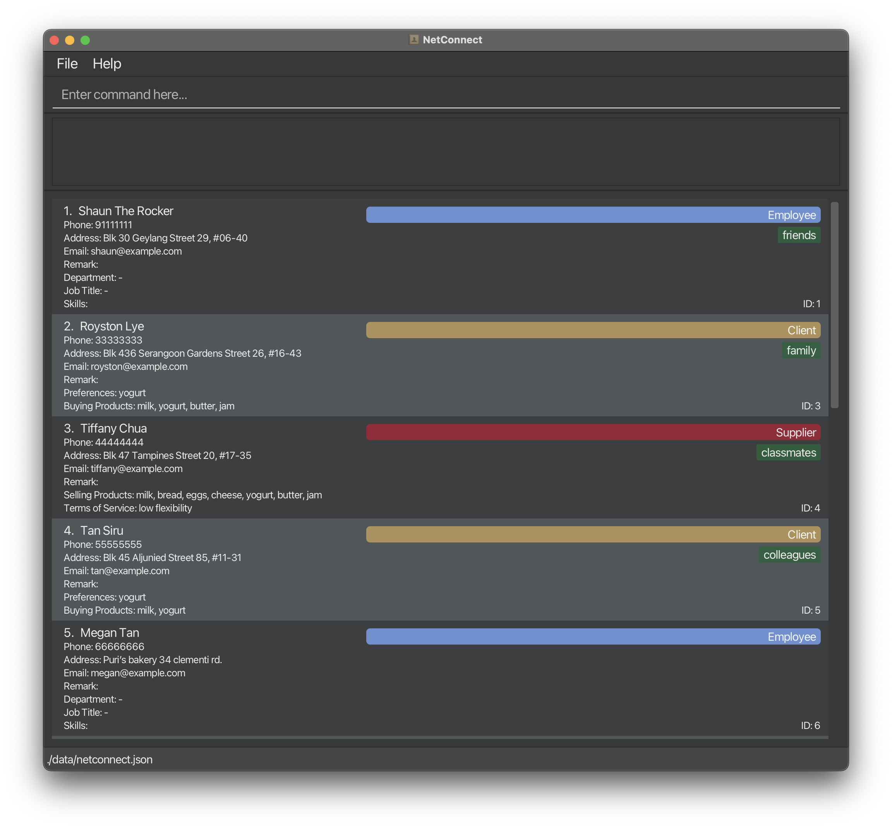
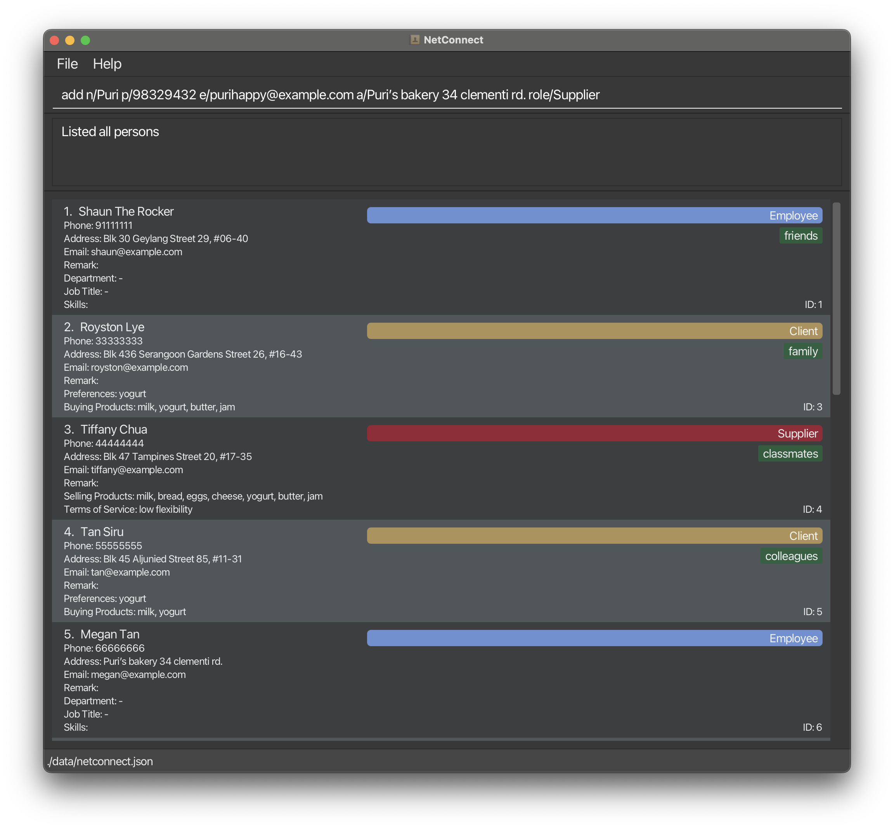
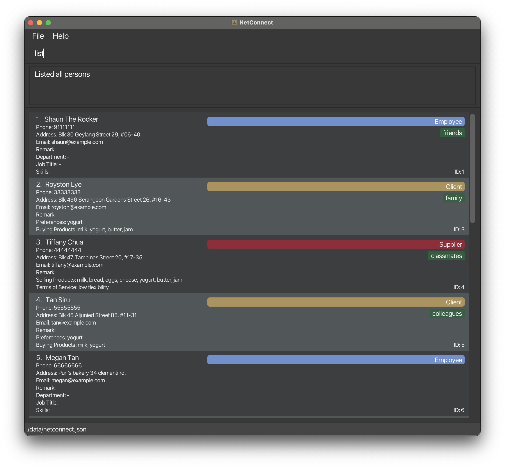
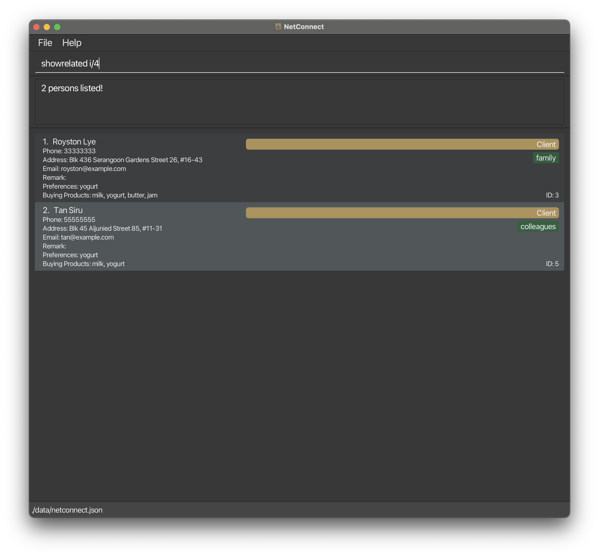

# Welcome to NetConnect

**NetConnect is a cutting-edge desktop application designed to streamline your contact management experience.** It combines the efficiency of a CLI (Command Line Interface) with the intuitiveness of a modern GUI (Graphical User Interface), making it the perfect tool for both casual users and professionals.

## Why NetConnect?

- **Sleek and Intuitive GUI:** Enjoy a visually pleasing experience with our application's interface, which simplifies your interaction and enhances productivity.
- **Powerful CLI Capabilities:** For those who prefer speed and efficiency, our CLI features allow for quick navigation and management of contacts.
- **Comprehensive Contact Management:** Store, search, edit, and delete contact details with ease. NetConnect supports a wide range of contact information types.
- **Data Backup:** You'll never have to worry about losing your data.

## Getting Started

- **Quick Start Guide:** Jump right in with our [User Guide](UserGuide.html#quick-start) and set up NetConnect in minutes.
- **Download Now:** Ready to get started? [Download the latest version of NetConnect here](https://github.com/AY2324S2-CS2103T-F12-1/tp/releases).

## Features

### Core Functionality
- **Viewing help:** `help`  
  Access detailed command usage instructions anytime.

- **Adding a person:** `add`  
  Create new contacts in your network effortlessly.

- **Deleting a person:** `delete`  
  Remove contacts that are no longer needed.

- **Listing all persons:** `list`  
  Get an overview of all your stored contacts.

- **Editing a person:** `edit`  
  Update contact details as needed.

### Advanced Search
- **Locating persons by name:** `find`  
  Quickly find contacts by their name, phone, remark, role, or tags.

### Data Management
- **Clearing all entries:** `clear`  
  Wipe your contact list for a fresh start.

- **Create Relations between Profiles:** `relate`  
  Link contacts together to map out your network.

- **Show Relations Associated to a Person:** `showrelated`  
  View the network of connections for a specific contact.

- **Open on Last State**  
  Pick up right where you left off in your last session.

- **Export Current View to CSV File:** `export`  
  Export your contacts for use in other applications.

### Additional Features
- **Never Miss a Birthday!**  
  Keep track of important dates like birthdays.

- **Exiting the program:** `exit`  
  Close NetConnect safely and securely.

### Data Handling
- **Saving the data**  
  Ensure your changes are stored persistently.

- **Editing the data file**  
  Make bulk changes to your contact list externally.

## Support

- **FAQ**  
  Find answers to common questions about NetConnect.

- **Known Issues**  
  Stay informed about any known software issues.

## For Developers

Interested in contributing to NetConnect? Check out the [Developer Guide](DeveloperGuide.html) for detailed information on how to get involved in development.

## Acknowledgements

NetConnect is built using some of the most reliable and efficient open-source libraries:

- [JavaFX](https://openjfx.io/) for the GUI
- [Jackson](https://github.com/FasterXML/jackson) for data handling
- [JUnit5](https://github.com/junit-team/junit5) for testing

## Gallery

Explore more through NetConnect's interface screenshots:

Embrace a new era of contact management with NetConnect. Download now and elevate your productivity to new heights.
